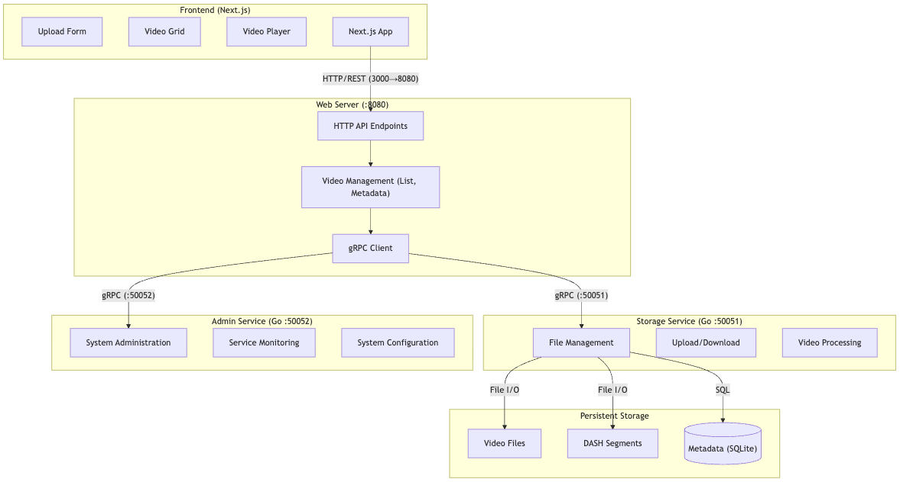

<div align="center">


# StreamShare

**A Distributed Video Streaming and Sharing Platform**

Built with Next.js frontend and Golang backend

</div>

---

## Overview

StreamShare is a scalable, distributed video streaming platform built using modern microservices architecture. It demonstrates enterprise-level design patterns for handling concurrent video uploads, adaptive bitrate streaming, and efficient distributed storage management.

---

## Features

- **Video Upload**: Drag-and-drop or click-to-browse file upload with progress tracking
- **Adaptive Streaming**: DASH.js powered video player with dynamic bitrate selection
- **Video Management**: Upload, view, and delete videos with ease
- **Dark Mode**: Toggle between light and dark themes for comfortable viewing
- **Responsive Design**: Seamless experience across desktop, tablet, and mobile devices
- **Distributed Architecture**: Horizontally scalable microservices with fault tolerance

---

## Architecture

### Overview

StreamShare uses a **microservices architecture** with the following components:



### Components

| Component | Purpose |
|-----------|---------|
| **Frontend** | Next.js web application providing user interface |
| **Web Server** | Central API gateway handling client requests |
| **Storage Service** | Manages video files and adaptive streaming segments |
| **Admin Service** | Handles system administration and monitoring |
| **Database** | SQLite for metadata storage |

### Architecture Principles

- **Separation of Concerns**: Each service has a single responsibility (API gateway, storage, administration)
- **Statelessness**: Web servers maintain no persistent state, enabling horizontal scaling
- **Asynchronous Communication**: Decoupled services communicate through well-defined protocols
- **Fault Tolerance**: Individual service failures don't bring down the entire system
- **gRPC Communication**: Efficient inter-service communication with Protocol Buffers

---

## Theory & Design Concepts

StreamShare implements several key distributed systems concepts:

### Key Concepts

- **Microservices Architecture**: The system is decomposed into independent services (Web Server, Storage Service, Admin Service) that communicate via gRPC, enabling scalability and independent deployment.

- **Adaptive Bitrate Streaming (DASH)**: Videos are encoded into multiple bitrate segments, allowing clients to dynamically select the best quality based on network conditions.

- **Protocol Buffers & gRPC**: Efficient serialization and RPC framework for inter-service communication with strong typing and language interoperability.

- **Distributed Storage**: Centralized storage service abstracts file management, allowing stateless web servers to handle concurrent requests.

- **Service Discovery & Coordination**: Uses etcd for dynamic service registration and discovery in distributed environments.

---

## Tech Stack

| Layer | Technology |
|-------|-----------|
| **Frontend** | Next.js 14, TypeScript, Tailwind CSS, DASH.js |
| **Backend** | Go 1.21+, gRPC, Protocol Buffers |
| **Storage** | File-based distributed storage system |
| **Database** | SQLite for metadata |
| **Deployment** | Docker and Docker Compose |

---

## Project Structure

```
streamshare/
├── frontend/                 # Next.js frontend application
│   ├── src/
│   │   ├── app/             # Next.js app router pages
│   │   ├── components/      # React components (Navigation, VideoCard, etc.)
│   │   └── public/          # Static assets
│   └── package.json
├── cmd/                      # Go service entry points
│   ├── web/                 # Web server (API gateway)
│   ├── storage/             # Storage service
│   └── admin/               # Admin service
├── internal/                 # Go backend implementation
│   ├── web/                 # Web server logic
│   ├── storage/             # Storage service logic
│   └── proto/               # Generated Protocol Buffer code
├── proto/                    # Protocol buffer definitions
│   ├── storage.proto
│   └── admin.proto
├── docker-compose.yml        # Docker setup for all services
├── start-servers.sh          # Quick start script
└── Makefile                  # Build and run commands
```

---

## Quick Start

### Prerequisites

- Node.js 18+
- Go 1.21+
- Docker and Docker Compose (optional)

### Option 1: Using Docker Compose (Recommended)

```bash
# Clone the repository
git clone <repository-url>
cd streamshare

# Start all services
docker-compose up -d

# Open your browser
# Visit http://localhost:3000
```

### Option 2: Manual Setup

#### 1. Clone the Repository

```bash
git clone <repository-url>
cd streamshare
```

#### 2. Start Backend Services

```bash
# Terminal 1: Start the web server
go run cmd/web/main.go sqlite ./metadata.db nw "localhost:8081,localhost:8090,localhost:8091,localhost:8092"

# Terminal 2: Start storage servers (in separate terminals)
mkdir -p storage/8090 storage/8091 storage/8092

go run cmd/storage -host localhost -port 8090 ./storage/8090
go run cmd/storage -host localhost -port 8091 ./storage/8091
go run cmd/storage -host localhost -port 8092 ./storage/8092
```

Or use the quick start script:
```bash
bash start-servers.sh
```

#### 3. Start Frontend

```bash
cd frontend
npm install
npm run dev
```

#### 4. Access the Application

Open your browser and navigate to: **http://localhost:3000**

---

## Usage Guide

### Upload Videos
1. Click the **"Upload Video"** button on the home page
2. Select a video file (supports common video formats)
3. Wait for upload to complete

### Browse & Stream
1. View all uploaded videos in the grid
2. Click any video to open the player
3. The player automatically selects the best bitrate for your connection

### Manage Videos
1. Hover over video cards to see options
2. Click delete button to remove videos
3. Use dark mode toggle in navigation for comfortable viewing

---

## Development

### Running in Development Mode

```bash
# Terminal 1: Backend services
bash start-servers.sh

# Terminal 2: Frontend development server
cd frontend
npm run dev
```

### Useful Commands

```bash
# Build frontend for production
cd frontend
npm run build
npm start

# Regenerate Protocol Buffers
protoc --go_out=. --go-grpc_out=. proto/*.proto

# Run tests (if available)
go test ./...
npm test
```

---

## Troubleshooting

| Issue | Solution |
|-------|----------|
| Frontend not connecting to backend | Ensure all Go services are running on their default ports (8080, 8090-8092, 8081) |
| Videos not loading | Check that the storage service is running and accessible at localhost:8090-8092 |
| Upload failures | Verify file size is reasonable and format is supported (MP4, WebM, etc.) |
| Port already in use | Kill existing processes: `pkill -f "go run" || pkill -f "npm run dev"` |
| Build errors | Ensure correct Go version (1.21+) and Node.js version (18+) |

---

## Additional Resources

- [Next.js Documentation](https://nextjs.org/docs)
- [Go Documentation](https://golang.org/doc/)
- [gRPC Documentation](https://grpc.io/docs/)
- [DASH.js Documentation](https://reference.dashif.org/dash.js/)

